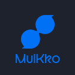
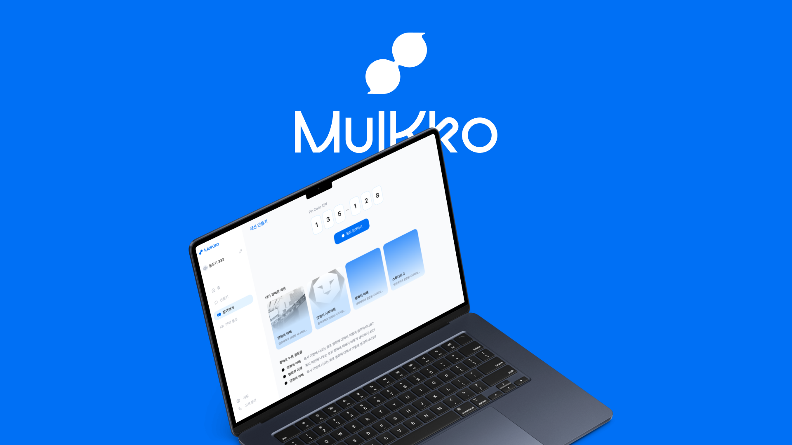
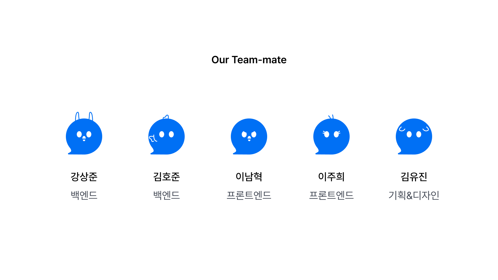

<h1 align="center">
  
  물꼬 (MulKko)
</h1>

  

> **말하기 어려웠던 질문에, 대화의 물꼬를 트다.**

물꼬는 교육 현장에서 학생과 교수 사이의 질문 장벽을 낮추기 위해 기획된 실시간 질문 기반 교육 플랫폼입니다.

수업 중 질문하고 싶지만 망설이는 학생, 질문이 나오지 않아 수업의 흐름을 파악하기 어려운 교수 모두를 위해 익명 질문, AI 기반 답변 보조, 실시간 세션 기능을 제공하여 더 활발한 상호작용이 이루어지는 수업 환경을 만드는 것을 목표로 합니다.

---

# 📖 프로젝트 소개

많은 학생들은 질문이 있어도 주변의 시선이나 분위기 때문에 손을 들지 못합니다. 반대로 교수는 학생들이 어디에서 어려움을 느끼는지 즉시 파악하기 어렵습니다.

물꼬는 이러한 문제를 해결하기 위해 만들어진 서비스입니다.

학생은 수업 코드(PIN)를 통해 간편하게 세션에 참여하고, 익명으로 질문을 작성할 수 있습니다. 교수는 질문을 실시간으로 확인하고 AI의 도움을 받아 답변을 준비하거나 학생들과 함께 토론을 이어갈 수 있습니다.

'질문' 자체보다 **질문을 시작하는 순간**, 즉 **대화의 물꼬를 트는 경험**에 집중한 서비스입니다.

---

# 👥 Team

  

| 분야 | 이름 |
|------|------|
| 기획 / 디자인 | 김유진 |
| Front-End | 이남혁, 이주희 |
| Back-End | 김호준, 강상준 |

---

# 📅 개발 기간

### 멋쟁이사자처럼 애거돈(해커톤)

- **2026.07.23 (목) 09:00 ~ 18:30**
- 기획 · 디자인 · 프론트엔드 · 백엔드 개발 진행

단 하루 동안 아이디어 도출부터 서비스 기획, UI/UX 디자인, 프론트엔드 및 백엔드 개발, 최종 발표까지 전 과정을 수행했습니다.

---

# 🏆 Achievement

🥇 **멋쟁이사자처럼 애거돈 해커톤 대상 (1위)**

- 참가 팀 : **5개 팀**
- 최종 결과 : **1위**

짧은 개발 시간 안에서도 서비스의 문제 정의, 사용자 경험, 완성도 높은 구현을 인정받아 최종 1위를 수상했습니다.

---

# ✨ 주요 기능

## 👨‍🏫 교수

- 수업 세션 생성
- PIN 코드 발급
- 실시간 질문 확인
- 질문 고정(Pin)
- AI 답변 추천
- 질문 해결 여부 관리
- 세션 종료

---

## 👨‍🎓 학생

- PIN으로 간편 참여
- 익명 질문 작성
- 다른 학생 질문 확인
- 질문 공감(좋아요)
- AI 답변 확인
- 실시간 질의응답 참여

---

## 🤖 AI 및 STT(예정)

- 질문 요약
- 답변 초안 생성
- 유사 질문 통합
- 핵심 키워드 추출
- 교수 답변 보조
- STT 활용 자동 답변 텍스트 입력

---

# 🎯 서비스 차별점

### 익명성을 통한 질문 장벽 해소

학생들은 이름이 공개되지 않아 부담 없이 질문할 수 있습니다.

### 실시간 질문 중심 수업

질문이 즉시 공유되어 교수와 학생 모두 현재 수업의 이해도를 확인할 수 있습니다.

### AI 기반 답변 보조

교수는 AI가 생성한 답변 초안을 참고하여 더욱 빠르고 정확한 설명을 제공할 수 있습니다.

### 질문 데이터 축적

수업이 끝난 후에도 질문과 답변이 남아 복습 자료로 활용할 수 있습니다.

---

# 🛠 Tech Stack

### Front-End

- React
- Vite
- Tailwind CSS

### Back-End

- Spring Boot
- MySQL

### Design

- Figma

### Collaboration

- GitHub
- Notion
- Figma

---

# 💡 서비스 비전

질문은 학습의 시작입니다.

물꼬는 학생들이 질문을 두려워하지 않는 교실, 교수와 학생이 더 자연스럽게 소통하는 수업 환경을 만들어 나갑니다.

**"질문 하나가, 수업의 흐름을 바꿉니다."**
